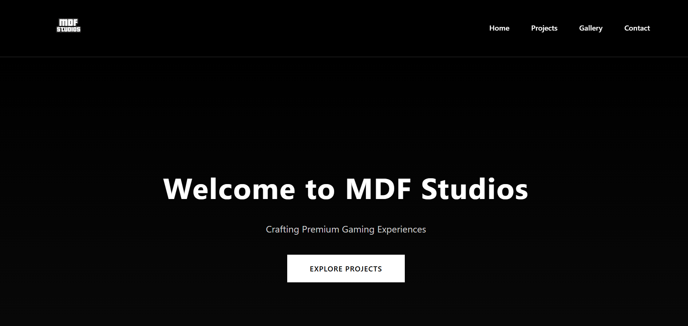
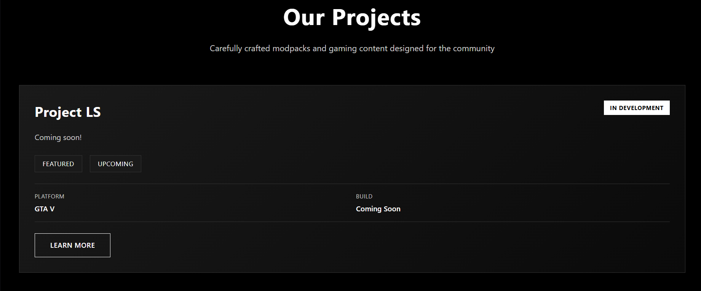
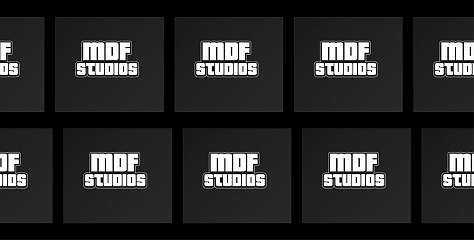
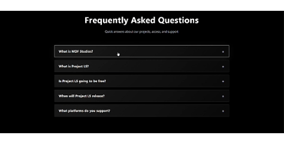

<h1 align="center">MDF STUDIOS — Official Website</h1>

This repository contains the official source code for the MDF Studios website. 
All content, structure, and design elements are the intellectual property of MDF Studios.

---

## Usage & Restrictions

You are strictly prohibited from:

- Copying, redistributing, modifying, or reusing any part of this website’s code or design  
- Claiming ownership of MDF Studios assets or branding  
- Using any part of this repository for commercial or unauthorized purposes  

Unauthorized use may result in appropriate action being taken by MDF Studios.

---

## Website Showcase

## Homepage

## Projects

## Gallery

## Q&A

## Footer

---

## Legal

- [Privacy Policy](https://mdf-development-git.github.io/mdfstudios/legal/Privacy%20Policy.pdf)
- [Terms of Service](https://mdf-development-git.github.io/mdfstudios/legal/Terms%20of%20Service.pdf)

---

<h3 align="center">© 2026 MDF Studios. All rights reserved.</h3>
